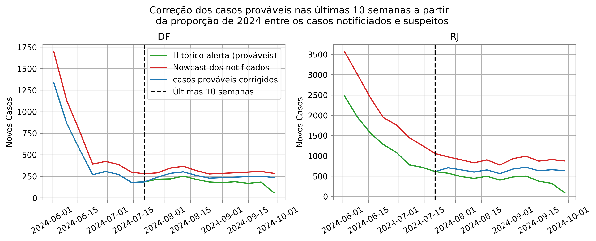
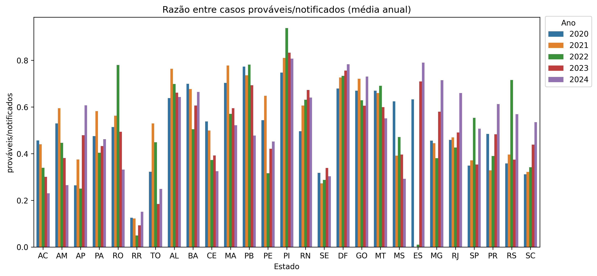
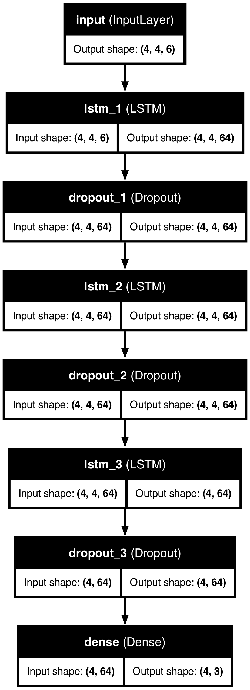
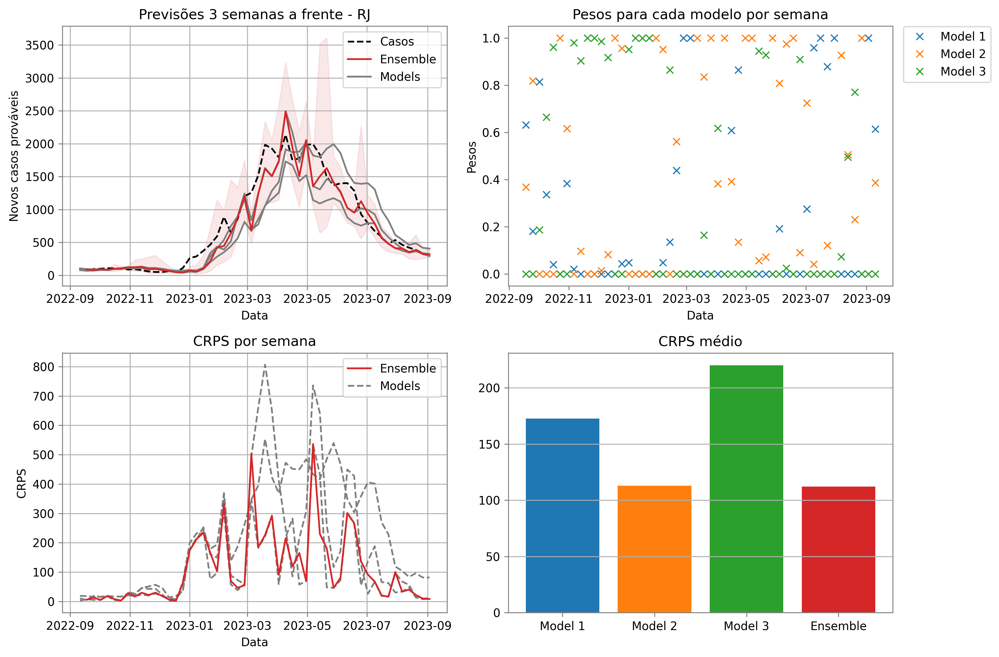

# Introdução

Para o ensemble de curto prazo foram utilizados três modelos diferentes. O primeiros deles é um modelo baseado em redes neurais LSTM, o segundo é um modelo baseado em processo gaussiano e o último um modelo ARIMA não sazonal e univariado. Os modelos serão apresentados em mais detalhes a seguir e foram treinados para prever os casos prováveis a nível de UF no Brasil (foi treinado um modelo para cada UF e um para o Brasil).

# Correção dos casos prováveis

Para a correção da curva assume-se que a curva de prováveis é uma proporção da curva dos casos notificados estimados pelo nowcast.  
A proporção utilizada foi calculada a partir da média da relação entre os casos notificados e prováveis no período entre 34 até 10 semanas atrás (assumindo que o delay é de 10 semanas em média, a proporção não seria calculada a partir de dados com delay).  

Esse período foi calculado com o objetivo de calcular a proporção usando os últimos 6 meses (24 semanas) de dados sem delay.  

Um exemplo das curvas corrigidas está apresentado na Figura 1.  
Na Figura \@ref(fig:med_c_prov) está apresentada a média anual da razão entre os casos prováveis e notificados a partir de 2020.

**Figura 1.** Comparativo entre as curvas de casos estimados pelo nowcast, casos prováveis e casos prováveis corrigidos para o DF e para o estado RJ.

**Figura 2.** Proporção média entre os casos prováveis e os notificados a partir de 2020 (média anual).

# Modelos

## LSTM

O modelo LSTM proposto utiliza os últimos 4 dados para prever as próximas 3 semanas.  
A arquitetura utilizada no modelo está apresentada na Figura 3 e consiste em 3 camadas LSTM treinadas com 64 *hidden units* cada.  

Os preditores utilizados estão apresentados na Tabela 1.  
Além disso, o modelo foi treinado a partir da série de casos transformada usando uma transformação de Box-Cox com $\lambda = 0.05$.

**Tabela 1.** Curvas utilizadas como preditores

| Nome         | Significado                                                                                           |
|---------------|-------------------------------------------------------------------------------------------------------|
| casos         | Casos prováveis por semana (alvo dos modelos)                                                        |
| diff_casos    | Diferença de primeira ordem dos casos prováveis                                                      |
| casos_mean    | Média dos casos prováveis em uma janela deslizante de 4 semanas                                      |
| casos_std     | Desvio padrão dos casos prováveis em uma janela deslizante de 4 semanas                              |
| casos_slope   | Coeficiente angular calculado a partir dos casos prováveis em uma janela deslizante de 4 semanas     |
| SE            | Semana epidemiológica                                                                                |

**Figura 3.** Arquitetura do modelo LSTM.

## Processo gaussiano

O modelo de processo gaussiano foi treinado usando os mesmos preditores apresentados na Tabela 1.  
Além disso, o modelo foi treinado a partir da série de casos transformada usando uma transformação de Box-Cox com $\lambda = 0.05$.  

O kernel do modelo de processo gaussiano proposto consiste na soma de dois kernels diferentes:  
o primeiro deles é um *Matern 3/2 kernel* com todos os preditores, e o segundo um kernel periódico apenas com o preditor **SE**.  

Na implementação foi utilizado o pacote **gpflow**  
([https://gpflow.github.io/GPflow/2.9.1/index.html](https://gpflow.github.io/GPflow/2.9.1/index.html)).

Esse modelo não prevê uma janela de valores; logo, para gerar as previsões, ele foi treinado para prever o número de casos 3 semanas à frente e foi aplicado utilizando uma janela deslizante.

## ARIMA

Foi aplicado um modelo ARIMA não sazonal univariado.  
Foi utilizada a implementação do pacote **mosqlient**.  
Nele, automaticamente os parâmetros do modelo são estimados de modo a minimizar o *Akaike Information Criterion* (AIC) a partir da série de entrada.

# Método de ensemble

Cada modelo acima fornece as previsões 3 semanas à frente com a mediana e o intervalo de confiança de 95%.  
Os passos para a aplicação do ensemble estão apresentados abaixo:

- Para cada modelo e ponto predito são aproximados os parâmetros de uma distribuição log-normal;  
- Aplicar a rotina de otimização para minimizar o **CRPS** (ou *log score*) do “pool” de distribuições log-normais;  
- A partir dos pesos obtidos pela rotina de otimização, obter os parâmetros da distribuição log-normal resultante e a mediana e os intervalos de confiança da previsão do ensemble.

# Resultados de validação

Para validar o método são utilizadas previsões fora de amostra 3 semanas à frente.  
Para validar a metodologia, os pesos foram calculados a partir das previsões e dos casos notificados na semana $t-1$ e utilizados para gerar a previsão do ensemble na semana $t$.  

Os resultados estão apresentados na Figura 4.

No painel superior esquerdo estão apresentados os casos em linha pontilhada preta, a mediana da previsão dos 3 modelos em cinza, e a mediana e os intervalos de confiança do ensemble em vermelho.  
No painel superior direito estão apresentados os pesos utilizados para cada semana, coloridos de acordo com o modelo.  
Neste painel nota-se que em muitos casos é escolhido majoritariamente um dos modelos.  

No painel inferior esquerdo estão apresentadas as curvas com o valor do **CRPS** semana a semana — em cinza, os valores dos modelos; em vermelho, o **CRPS** do ensemble.  
No painel inferior direito estão apresentados os valores médios do **CRPS** no período, coloridos por modelo.  
O painel mostra que o **CRPS** do ensemble é ligeiramente menor do que o de qualquer outro modelo.

**Figura 4.** Resultados da validação.

